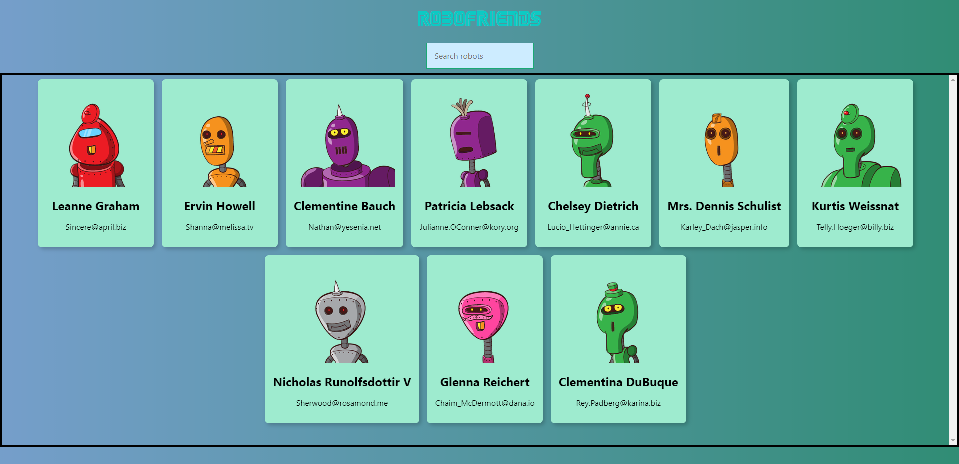

# Read me Template



---

### Table of Contents

- [Description](#description)
- [How To Use](#how-to-use)
- [API References](#references)
- [License](#license)
- [Author Info](#author-info)

---

## Description

This is a simple web application that displays basic user details with searching capabilities

#### Technologies

- React JS
- Redux

[Back To The Top](#read-me-template)

---

## How To Use

The website is published at [Robofriends](https://pras306.github.io/robofriends/)

Clone the project 

```bash
  git clone https://github.com/pras306/robofriends.git
```

Go to the project directory

```bash
  cd robofriends
```

Install dependencies

```bash
  npm install
```

Start the server

```bash
  npm run start
```

---

#### API Reference

[JSON Placeholder](https://jsonplaceholder.typicode.com/)
[Robo Hash](https://robohash.org/)


[Back To The Top](#read-me-template)

---

## License

MIT License

Copyright (c) [2017] [James Q Quick]

Permission is hereby granted, free of charge, to any person obtaining a copy
of this software and associated documentation files (the "Software"), to deal
in the Software without restriction, including without limitation the rights
to use, copy, modify, merge, publish, distribute, sublicense, and/or sell
copies of the Software, and to permit persons to whom the Software is
furnished to do so, subject to the following conditions:

The above copyright notice and this permission notice shall be included in all
copies or substantial portions of the Software.

THE SOFTWARE IS PROVIDED "AS IS", WITHOUT WARRANTY OF ANY KIND, EXPRESS OR
IMPLIED, INCLUDING BUT NOT LIMITED TO THE WARRANTIES OF MERCHANTABILITY,
FITNESS FOR A PARTICULAR PURPOSE AND NONINFRINGEMENT. IN NO EVENT SHALL THE
AUTHORS OR COPYRIGHT HOLDERS BE LIABLE FOR ANY CLAIM, DAMAGES OR OTHER
LIABILITY, WHETHER IN AN ACTION OF CONTRACT, TORT OR OTHERWISE, ARISING FROM,
OUT OF OR IN CONNECTION WITH THE SOFTWARE OR THE USE OR OTHER DEALINGS IN THE
SOFTWARE.

[Back To The Top](#read-me-template)

---

## Author Info

- Github - [pras306](https://github.com/pras306)
- LinkedIn - [Prasanna Sriram](https://www.linkedin.com/in/prasanna-sriram/)

[Back To The Top](#read-me-template)